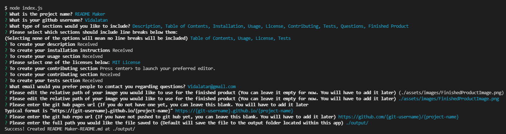

# README Maker

## Description
<!-- Here you should enter a little about your project. -->

A README Maker that utilizes [inquirer](https://github.com/SBoudrias/Inquirer.js#readme) and [node-fetch](https://github.com/node-fetch/node-fetch). The README Maker guides the user through several prompts to allow them to conveniently make a professional looking README file. It includes all sections you would commonly see, as well as a couple of extra sections in case the user wants to add additional content.

(Yes this README was made entirely with this application)

## Table of Contents

1.  [Installation](#installation)

2.  [Usage](#usage)

3.  [License](#license)

4.  [Contributing](#contributing)

5.  [Tests](#tests)

6.  [Questions](#questions)

7.  [Finished Product](#finished-product)

---

## [Installation](#installation)
<!-- Here you should enter how to install your project. You can use the outline below, or create one yourself -->
<!-- If you would like to have images in your instructions, enclose them like so:  -->

<!-- Make sure to have a '>' character before each new line -->
>## Step One
>Get the code.
>
>You can either clone the repository, or download it as a zip file and unzip them to wherever you prefer to keep it.

>## Step Two
>Install dependencies.
>
>Open up a terminal at the location of the 'readme_maker' and run npm install. This should install all the dependencies required to run the application.

>## Step Three
>Double check that all dependencies were installed.
>
>Running the npm install command should have installed [inquirer](https://github.com/SBoudrias/Inquirer.js/) and [node-fetch](https://github.com/node-fetch/node-fetch)

## [Usage](#usage)
<!-- Here you should enter how to use your project. You can use the outline below, or create one yourself -->
<!-- If you would like to have images in your how to, enclose them like so  -->

<!-- Make sure to have a '>' character before each new line -->
>## Step One
>To run the app, first make sure your terminal is located at the 'readme_maker' directory.

>## Step Two
>Then, enter 'node index.js' into the terminal
>
>It should begin with a prompt asking for the project name

>## Step Three
>Follow the prompts as they are given. Some prompts may open up a text editor (usually notepad or vim depending on your OS).
>
>If you do not see a text editor appear, check to see if it opened up behind another window (it does that sometimes).

>## Exiting
>If you wish to cancel out of the app before finishing with the prompts:
>On most terminals run through windowsOS, press 'ctrl + c'
>On most terminals run through macOS, press 'Command + . '

---

## [License](#license)

 Copyright (c) 2022 Vidalatan Licensed under the MIT License license.

---

## [Contributing](#contributing)
<!-- Here you should enter how someone should contribute to your project, or what guidelines to follow -->

When contributing to this repository, please first discuss the change you wish to make via email.

### Pull Request Process
1. Ensure any install or build dependencies are removed before requesting a pull on the build.
2. Update the README.md with details of changes to the interface
3. You may merge the Pull Request in once you have the sign-off of two other developers, or if you do not have permission to do that, you may request the second reviewer to merge it for you.

## [Tests](#tests)
<!-- Here you should enter how you have tested the project, and possibly any images or videos demonstrating it's use -->
<!-- You can format your images or videos like this:  -->

The current build of this app has been tested for all sections and optional breaks added. Below is a brief demonstration of the app in use.

https://user-images.githubusercontent.com/59946423/160298130-376feec5-f7ec-47e9-966e-afcf225b4467.mp4

Changing the path to save the README file has also been tested.

---

## [Questions](#questions)

 Questions regarding this project should be directed towards @Vidalatan at Vidalatan@gmail.com

## [Finished Product](#finished_product)

Link to [Code Repository](https://github.com/vidalatan/readme_maker)

